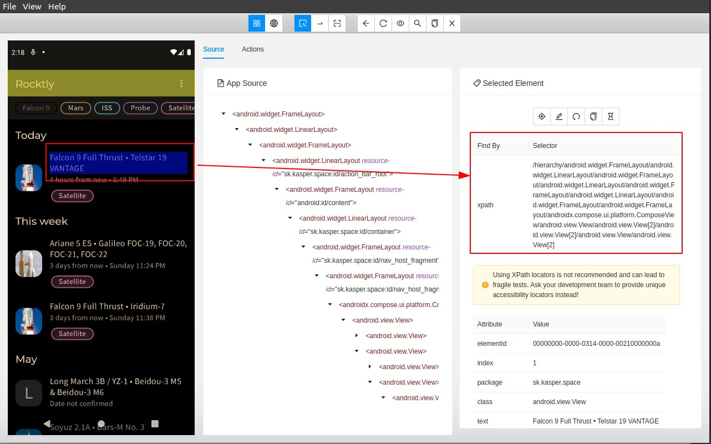

# **Appium UI tesztelés**
## Dokumentáció

### **Bevezetés:**
A teszteléshez az appium ui tesztelőt választottam, amit linux operációs rendszeren használtam.
Először is a környezet felállításával kezdtem, amivel eléggé meg gyűlt a bajom, mivel több
környezeti változó nem volt beállítva és én még nem csináltam ilyet.

### **Első UI teszt:**
Az első UI tesztem nem az apphoz tartozott, hanem a hivatalos “Getting started” útmutatóban
letölthető teszt appot, egy általuk bemutatott teszt volt. Ezen keresztül értettem meg, hogy a
egyáltalán, hogy kell megadni a tesztnek, hogy melyik .apk fájlt használja. Ezt sikeresen ki is
próbáltam.
Ezután rá kellett jönnöm, hogy nem olyan egyszerű egy compose-al létrehozott android appot
tesztelni, mert itt az elemek id-ja nem teljesen egyéretelmű.

### **Compose app tesztelése:**
Első ötletem, az volt, hogy a képernyőre kattintva adom meg a lépéseket és az elvárt UI-t egy screenshottal adom, meg. Viszont ez sajnos nem sikerült viszont hellyette megismertem a „Appium- Inspector” nevű alkalmazást, ami elsőnek bonyolultnak tűnt, de később rájöttem, hogy az eszköz
beállítása teljesen ugyan az, mint a sima appium javascriptes fájlnak.
Miután beállítottam a kapcsolatot az alkalmazásban, megjelent az app, amelyben minden elemnek
egy úgy nevezett „xpath”-jét ki lehetett nyerni, ezzel tudtam a javascriptben az elemek lekérni.

### **Tényleges UI tesztek:**
Három UI tesztet hoztam létre:
- A téma átváltás sötétre, majd ezt ellenörzése.
- Lista elem kattintása után a ui feltöltődik e rendesen (rakéta  név, kilövés neve).
- Lista elem kattintása után a fejlécben a tag megjelenik e.
- A szűrt kategóriák megeggyeznek-e a választottal.

### **Sötét téma ell.:**
A teszt során az appium belép a beállításba és ott beállítja a témát sötét témára. Ezután kiolvasom,
hogy tényleg az lett e kiválasztva.

### **UI feltöltésének tesztelése.:**
A teszt célja, hogy a listán lévő név: (<rakéta név> • <kilöés név>) felbomlik a és feltölti a UI-t.
Menete: elmenti az első lista elem nevét, majd szét bontja kódban. Ezután rákattint a listaelemre és
megnézi, hogy a kellő nevek jellenek meg a felületen.

### **Tag megjelenésének tesztelése.:**
A teszt célja, hogy a lista elemen lévő tagek a lista elem megnyitása után is megmarad.
Menete: elmenti a listaelem tagjének nevét, majd a lista elemre rákattintva, megnyitja azt és ezután
ellenörzi, hogy a tag tényleg ott van e a helyén.

### **Kategória szűrés**
A teszt célja, hogy ha rákattintunk egy választott kategóriára ami alapján szűrni szeretnénk a listát, akkor a leszűrt elemek első tagja valóban a kiválasztott kategóriába tartozik-e.
Menete: Rákattint egy categóriára, aminek elmenti a nevét majd a leszűrt lista első elemének a kategóriájával ezt össze fogja hasonlítani.